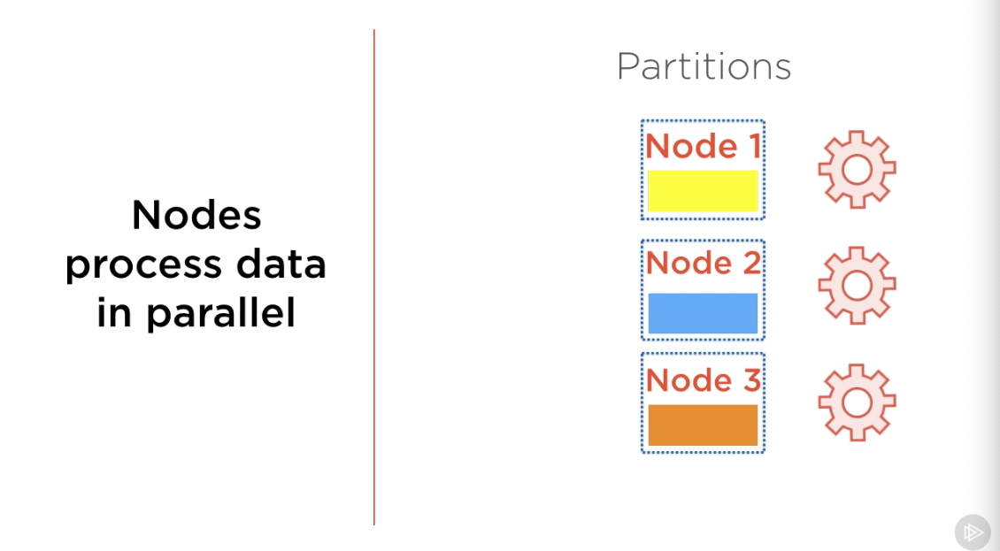

* Spark 1.x is a great general purpose computing engine
* Spark 2.x takes it to a new level in several ways
  * 2nd generation of Tungsten engine provides 10x performance improvement
  * Unified APIs for Datasets and DataFrames and Spark SQL
    * Structured format

## Intro to Spark
* Unified analytics engine for large-scale processing
* Spark is built on top of Hadoop, can be run alone
* HDFS, MapReduce, YARN (Hadoop)


* Spark Core - general purpose computing engine
* YARN Cluster Manager - once the task has been defined, this will be run as a
job by cluster manager
* HDFS - the underlying data will be stored on HDFS
* Spark libraries: Spark SQL, Spark Streaming, MLib, GraphX are all built on top
of Spark Core
* With Spark your work on data as it would be on a single node, but under the
hood there is a distributed computing engine that runs multiple processes.
* Real-time as well as batch Spark with the same APIs
* Spark has an easy REPL environment


## RDDs and Spark 1.x
* Why is this relevant in Spark 2
* Despite the fact we are using different API in Spark 2, RDD's are still the
fundamental blocks of Spark (DataFrames are built on top of RDD's)
* All operations in Spark are performed on in-memory objects (RDD's)
* An RDD is a collection of entities - rows, records, strings, integers
* It can be assigned to a variable and methods can be invoked on it
* Methods return values or apply transformations on the RDDs

## Characteristics of RDDs
* Partitioned/Distributed - split across data nodes in a cluster
  * RDD's are distributed collections
  * Can be produces in parallel
* Immutable - RDD's once created cannot be changed, it creates a new RDD's
* Resilient - can be fault tolerant


* Partitions are distributed to multiple machines, called nodes



* Data is stored in memory for each node in the cluster


* Two things can be operations can be performed on RDD:
  * Transformation - does some transformation and creates a new RDD
    * You load a dataset into an RDD
    * The user may define a chain of transformations on the dataset
    * Transformations are executed only when a result is requested
  * Action - request a result
    * See the first 10 rows
    * A count
    * A sum

* RDDs can be reconstructed even the node crashes or fails
  * There are 2 ways in which RDD's can be created
    * Reading a file
    * Apply transformation for an exisiting RDD and generate a new RDD
    * Every RDD keeps track of where it came from (the file source or another RDD)
  * As you perform a series of operations it tracks every transformation which
led to the current RDD. The chain of transformation. The transformations are
tracked in metadata and are called the **RDD's lineage**. Every RDD is aware
back to it's original source of data and it allows RDDs to be reconstructed when
nodes crash

* If you work with Spark 2, you may never encounter RDD's


## RDDs, DataFramews, Datasets
* In Spark 2 you ca nuse DataFrame or if you are in Scala / Java you can use a
Dataset
* Dataset is typed data and only available fro strongly typed languages such as
Java or Scala
  * Provide compile time safety
* A DataFrame represents data in a tabular format layout as rows and columns.
* Every row in a DataFrame represents 1 record or observation
* Each column represents 1 variable (a list or vector)
* Spark does the ETL for you when you load a file / read from a file, it
automatically creates a DataFrame for you


  


* Datasets are built on top of RDD's

## SparkSession
* In Spark 2, SparkContext is wrapped into SparkSession
* SparkSession is what interacts with YARN (cluster manager)
  * Orchestrates execution of jobs
  * Workers are compute nodes in cluster
  * Runs the spark application code
  * When SparkContext created, each worker start executors
  * Executors are distributed agents that execute tasks
  * Tasks are basic units of execution
  * Tasks belog inside stages


## Demo Spark 2

```py
from pyspark.sql.types import Row
# Row is a spark object and should represent a single record in our data frame
from datetime import datetime
from pyspark.sql import SparkSession

spark = SparkSession \
    .builder \
    .appName("Python Spark SQL basic example") \
    .config("spark.some.config.option", "some-value") \
    .getOrCreate()

# converts any list into an RDD
simple_data = spark.sparkContext.parallelize([1, 'Alice', 50])
# if you want to access sparkContext and all their methods
simple_data.count()
# 3 there are three elements in the RDD
simple_data.first()
# 1 gives us first element in the RDD
simple_data.take(2)
# [1, 'Alice']
simple_data.collect()
# [1, 'Alice', 50]
# you can convert RDD into a dataframe by using toDF() method
#df = simple_data.toDF() # if you run this you'll get an error can not infer schema for type: <class 'int'>
# simple_data has no schema and cannot converted to DataFrame

# parallelize creates an RDD
records = spark.sparkContext.parallelize([[1, 'Alice', 50], [2, 'Bob', 80]])
# while converting this RDD to a DataFrame spark infers the schema
df = records.toDF()
df.printSchema()
df.show()

#if you want to associate columns to a specific names you need to create a Row object
# Row is an object offered by the Spark library and is used to represent a single record with multiple fields
data = spark.sparkContext.parallelize([Row(id=1, name='Alice', score=50)])
# conversion of RDD to a DataFrame
df_ = data.toDF()
df_.printSchema()
df_.show()

complex_data = spark.sparkContext.parallelize([Row(
    col_float=1.44,
    col_integer=10,
    col_string='John',
    col_list=[1,2,3,4],
    col_dict={'k1': 0},
    col_row=Row(a=40, b=50),
    col_time=datetime(2014,8,2,14,1,6),
    col_boolean=True
)])
complex_data.count()
cdf = complex_data.toDF()
cdf.show()
# a DataFrame is a list of Row objects

column_names = Row('id', 'name', 'score')
students = records.map(lambda r: column_names(*r))
# the map() operation performs a transformation on every element in the RDD
# the map() operation is not supported on dataframes because if you perform a computation
# on every record on a dataframe will typically store the result in a new column in the resulting dataframe
print(students.collect())
students.toDF().show()

cell_float = cdf.collect()[0][1] # this is called a matrix notation 
#1.44
cell_list = cdf.collect()[0][4]
print('cell_list value follows after')
print(cell_list)
cell_list.append(100)
cell_list

# Extract specific columns by converting to an RDD
extr = cdf.rdd.map(lambda x: (x.col_string, x.col_integer))
# [('John', 10)]
extr_ = extr.map(lambda r: Row(str_=r[0], score=r[1]))
# converted from [Row()] RDD to a dataframe
extr_.toDF().show()


# A better way to extract specific dictionary df is to use
# only available on DataFrames
cdf.select('col_string', 'col_integer').show()

# map() DataFrames do not suppor the map operation
# If you want to calculate some value on every record on a dataframe use withColumn
cdf.rdd.map(lambda x: (x.col_string + " Boo")).collect()
# ['John Boo']

# in this example we create a new data frame that contains col_integer and col_float
# we use the .withColumn method to add a new column with computed values
cdf.select('col_integer', 'col_float')\
    .withColumn(
        'col_sum',
         cdf.col_integer + cdf.col_float
        ).show()

# calculates a new column col_opposite
cdf.select('col_boolean')\
    .withColumn(
        'col_opposite',
        cdf.col_boolean == False
    ).show()

# renaming of the column
# all of the operations don't affect the original dataframe a new dataframe gets created
cdf.withColumnRenamed('col_dict', 'col_map').show()

# select a specific column and rename it
# new dataframe gets created with a single column and aliased as the name column
cdf.select(cdf.col_string.alias('Name')).show()

# spark data frames can be converted to pandas data frames
# df_pands = cdf.toPandas()
# spark data frames are build on top of RDD's and distributed across nodes cluster
# pandas data frames will be in memory on a single machine 
# creates a spark data frame from pandas data frame
# the result will be spark RDD
# df_spark = sqlContext.createDataFrame(df_pandas).show()
```

## Difference between Spark 2 vs. Spark 1
* Spark 2
  * Univies datasets and dataframes and makes sql support native
  * Optimize like a compiler, not a DBMS
  * Use of use: unified API for DataFrames for Batch and Streaming data
  * spark.ml and ML pipelines
  * Advanced streaming (windows, watermarking)
  * DataFrame & Dataset are now DataFrame
    * Untyped API
    * Typed API (Dataset)
  * Structured Streaming in Spark 2 and Streaming in Spark 1

**Important:** The bottleneck now in computing is CPU and not disk (SSD) or
network connection
