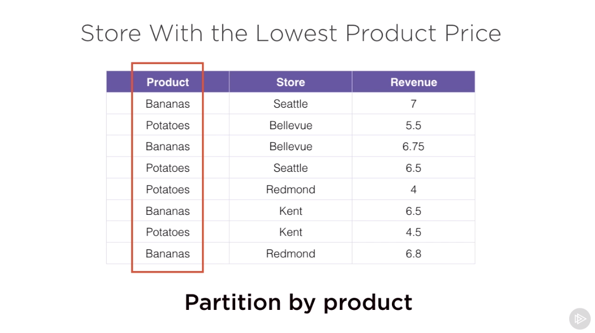
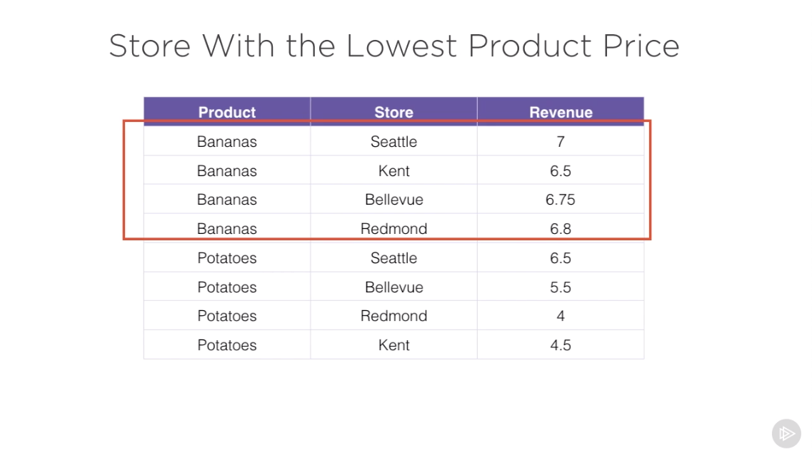
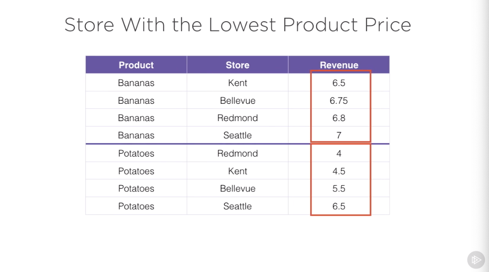
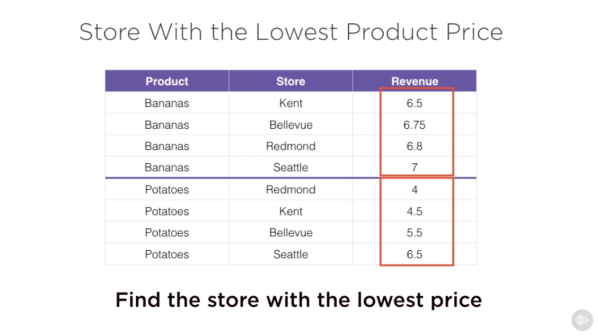
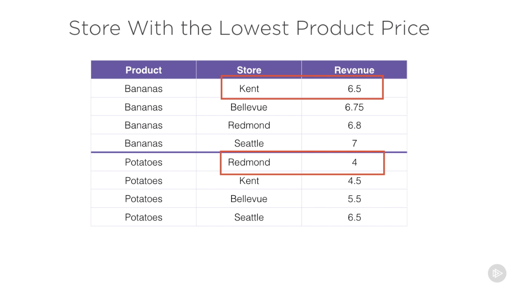
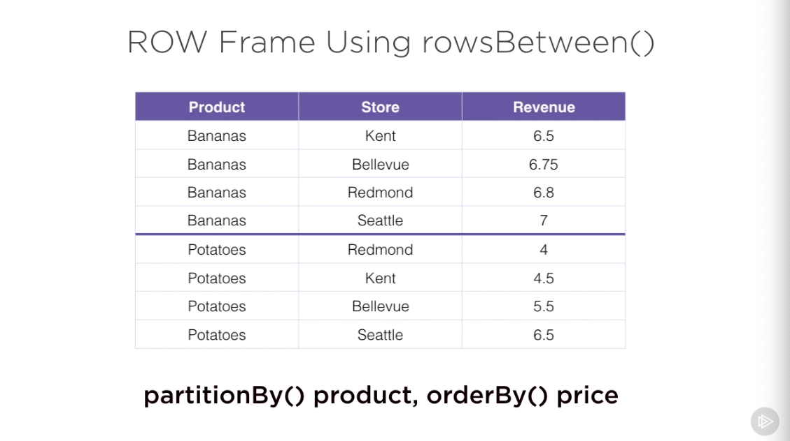
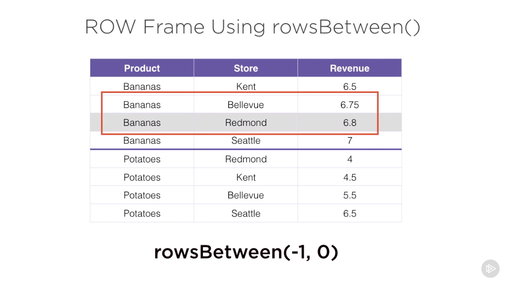
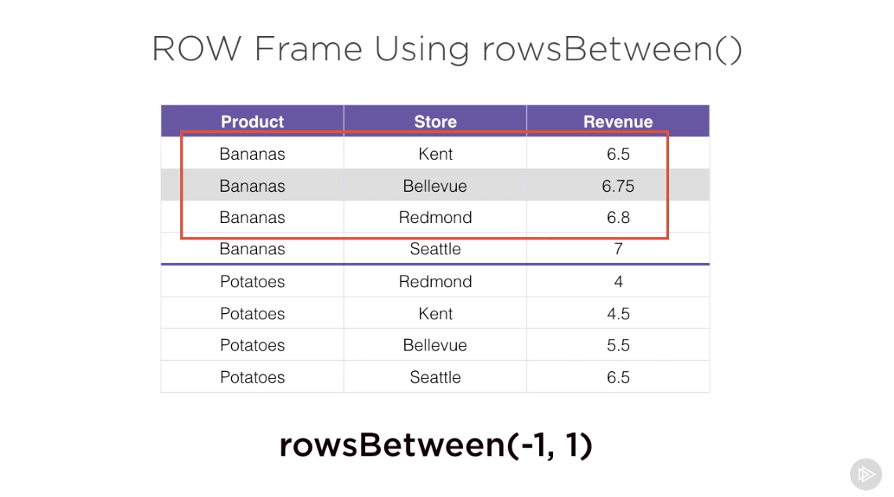
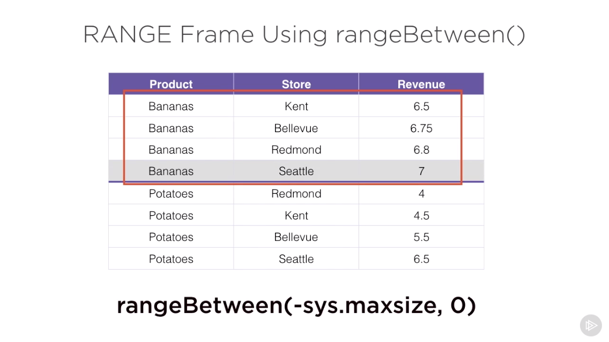
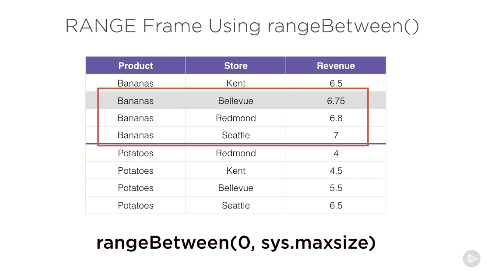

# Querying Data Using Spark SQL

* Spark SQL enables querying of DataFrames as database tables
* Before you start query them you need to register them as temporary per-session
  and global tables (available across all spark sessions)
* Spark 2.x has the catalyst optmimizer which makes SQL queries fast
* Tables schema can be inferred or explicitly specified of your sql tables
* Advanced window operations are also supported


```md
from pyspark.sql import SparkSession

# entry point into our spark application
spark = SparkSession.builder\
                    .appName('Analyzing airline data')\
                    .getOrCreate()


from pyspark.sql.types import Row
# use Row object to setup data for the SQL tables

from datetime import datetime

# use sparkContext.parallelize function to set up RDD of Row objects

record = spark.sparkContext.parallelize([Row(id = 1,
                                            name = 'Jill',
                                            active = True,
                                            clubs = ['chess', 'hockey'],
                                            subjects = {'math': 80, 'english': 56},
                                            enrolled = datetime(2014, 8, 1, 14, 1, 5)),
                                        Row(id = 2,
                                           name = 'George',
                                           active = False,
                                           clubs = ['chess', 'soccer'],
                                           subjects = {'math': 60, 'english': 96},
                                           enrolled = datetime(2015, 3, 21, 8, 2, 5))
                                        ])
record_df = record.toDF()
record_df.show() # RDD converted to a DataFrame

+------+---------------+-------------------+---+------+--------------------+
|active|          clubs|           enrolled| id|  name|            subjects|
+------+---------------+-------------------+---+------+--------------------+
|  true|[chess, hockey]|2014-08-01 14:01:05|  1|  Jill|[english -> 56, m...|
| false|[chess, soccer]|2015-03-21 08:02:05|  2|George|[english -> 96, m...|
+------+---------------+-------------------+---+------+--------------------+

# in order to run sql queries on the dataframe we need first register dataframe as a table
record_df.createOrReplaceTempView('records')
# creates a table that is per-session, not shared across Spark sessions
# as soon as the session ends the table will disapear as well

all_records_df = spark.sql('select * from records')
all_records_df.show()
# all dataframe operations can be performed on the result of the sql query

+------+---------------+-------------------+---+------+--------------------+
|active|          clubs|           enrolled| id|  name|            subjects|
+------+---------------+-------------------+---+------+--------------------+
|  true|[chess, hockey]|2014-08-01 14:01:05|  1|  Jill|[english -> 56, m...|
| false|[chess, soccer]|2015-03-21 08:02:05|  2|George|[english -> 96, m...|
+------+---------------+-------------------+---+------+--------------------+

all_records_df_ = spark.sql('select id, clubs[1] as club, subjects["english"] as subject from records')
all_records_df_.show()

+---+------+-------+
| id|  club|subject|
+---+------+-------+
|  1|hockey|     56|
|  2|soccer|     96|
+---+------+-------+

all_records_df_log = spark.sql('select id, not active from records')
all_records_df_log.show()

+---+------------+
| id|(NOT active)|
+---+------------+
|  1|       false|
|  2|        true|
+---+------------+

all_records_df_where = spark.sql('select * from records where active')
all_records_df_where.show()

+------+---------------+-------------------+---+----+--------------------+
|active|          clubs|           enrolled| id|name|            subjects|
+------+---------------+-------------------+---+----+--------------------+
|  true|[chess, hockey]|2014-08-01 14:01:05|  1|Jill|[english -> 56, m...|
+------+---------------+-------------------+---+----+--------------------+

all_records_df_gt = spark.sql('select * from records where subjects["english"] > 90')
all_records_df_gt.show()

+------+---------------+-------------------+---+------+--------------------+
|active|          clubs|           enrolled| id|  name|            subjects|
+------+---------------+-------------------+---+------+--------------------+
| false|[chess, soccer]|2015-03-21 08:02:05|  2|George|[english -> 96, m...|
+------+---------------+-------------------+---+------+--------------------+


# if you want to make the sql table to be accessbile to all spark sessions on the cluster
# register it as a global table
record_df.createGlobalTempView('global_records')

global_all = spark.sql('select * from global_temp.global_records')
# make sure to add global_temp prefix in order to access your table
global_all.show()

al_all.show()

+------+---------------+-------------------+---+------+--------------------+
|active|          clubs|           enrolled| id|  name|            subjects|
+------+---------------+-------------------+---+------+--------------------+
|  true|[chess, hockey]|2014-08-01 14:01:05|  1|  Jill|[english -> 56, m...|
| false|[chess, soccer]|2015-03-21 08:02:05|  2|George|[english -> 96, m...|
+------+---------------+-------------------+---+------+--------------------+

``` 

```md
from pyspark.sql import SparkSession

spark = SparkSession.builder\
                    .appName('Analyzing airline data')\
                    .getOrCreate()
from pyspark.sql.types import Row
from datetime import datetime

airlinesPath = './airlines.csv'
flightsPath = './flights.csv'
airportsPath = './airports.csv'
# we have 3 different datasets

airlines = spark.read\
                .format('csv')\
                .option('header', 'true')\
                .load(airlinesPath)

airlines.createOrReplaceTempView('airlines')

airlines = spark.sql('select * from airlines')
airlines.columns
#['Code', 'Description']

airlines.show(5)

+-----+--------------------+
| Code|         Description|
+-----+--------------------+
|19031|Mackey Internatio...|
|19032|Munz Northern Air...|
|19033|Cochise Airlines ...|
|19034|Golden Gate Airli...|
|19035|  Aeromech Inc.: RZZ|
+-----+--------------------+

flights = spark.read\
                .format('csv')\
                .option('header', 'true')\
                .load(flightsPath)


flights.createOrReplaceTempView('flights')
flights = spark.sql('select * from flights')
flights.columns

['date',
 'airlines',
 'flight_number',
 'origin',
 'destination',
 'departure',
 'departure_delay',
 'arrival',
 'arrival_delay',
 'air_time',
 'distance']

flights.show(5)
+----------+--------+-------------+------+-----------+---------+---------------+-------+-------------+--------+--------+
|      date|airlines|flight_number|origin|destination|departure|departure_delay|arrival|arrival_delay|air_time|distance|
+----------+--------+-------------+------+-----------+---------+---------------+-------+-------------+--------+--------+
|2014-04-01|   19805|            1|   JFK|        LAX|     0854|          -6.00|   1217|         2.00|  355.00| 2475.00|
|2014-04-01|   19805|            2|   LAX|        JFK|     0944|          14.00|   1736|       -29.00|  269.00| 2475.00|
|2014-04-01|   19805|            3|   JFK|        LAX|     1224|          -6.00|   1614|        39.00|  371.00| 2475.00|
|2014-04-01|   19805|            4|   LAX|        JFK|     1240|          25.00|   2028|       -27.00|  264.00| 2475.00|
|2014-04-01|   19805|            5|   DFW|        HNL|     1300|          -5.00|   1650|        15.00|  510.00| 3784.00|
+----------+--------+-------------+------+-----------+---------+---------------+-------+-------------+--------+--------+

flights.count(), airlines.count()
# use count() method to see the size of the dataset (476881, 1579)

flights_count = spark.sql('select count(*) as count from flights')
airlines_count = spark.sql('select count(*) as count from airlines')

flights_count, airlines_count
# (DataFrame[count: bigint], DataFrame[count: bigint])

flights_count.collect()[0][0], airlines_count.collect()[0][0]
# (476881, 1579)

# the results of our sql queries are dataframes we can mix sql queries with dataframe operations such as agg

total_distance_df = spark.sql('select distance from flights')\
                            .agg({'distance': 'sum'})\
                            .withColumnRenamed('sum(distance)', 'total_distance')

total_distance_df.show()

+--------------+
|total_distance|
+--------------+
|  3.79052917E8|
+--------------+

total_distance_df_sql = spark.sql('select sum(distance) as total_distance from flights')
total_distance_df_sql.show()

+--------------+
|total_distance|
+--------------+
|  3.79052917E8|
+--------------+

all_delayed_2012 = spark.sql(
    'select date, airlines, flight_number, departure_delay ' +
    'from flights where departure_delay > 0 and year(date) = 2012'
)

all_delayed_2012.show()
# our files contain flight data only for the year 2014 that's why we're getting an empty dataframe

+----+--------+-------------+---------------+
|date|airlines|flight_number|departure_delay|
+----+--------+-------------+---------------+
+----+--------+-------------+---------------+

all_delayed_2014 = spark.sql(
    'select date, airlines, flight_number, departure_delay ' +
    'from flights where departure_delay > 0 and year(date) = 2014'
)

all_delayed_2014.show(5)

+----------+--------+-------------+---------------+
|      date|airlines|flight_number|departure_delay|
+----------+--------+-------------+---------------+
|2014-04-01|   19805|            2|          14.00|
|2014-04-01|   19805|            4|          25.00|
|2014-04-01|   19805|            6|         126.00|
|2014-04-01|   19805|            7|         125.00|
|2014-04-01|   19805|            8|           4.00|
+----------+--------+-------------+---------------+

all_delayed_2014.createOrReplaceTempView('all_delays')
# we register a new temporary table that contains all the delayed flights

all_delayed_2014.orderBy(all_delayed_2014['departure_delay'].desc()).show(5)
# before we saw that departure_delay can be higher than 99.00 e.g. 126.00 or 125.00 minutes
# we're getting 99.00 as the max. departure_delay here, because the data is treaded as a string

+----------+--------+-------------+---------------+
|      date|airlines|flight_number|departure_delay|
+----------+--------+-------------+---------------+
|2014-04-29|   20366|         5958|          99.00|
|2014-04-29|   19977|          439|          99.00|
|2014-04-29|   20366|         6046|          99.00|
|2014-04-29|   20366|         4187|          99.00|
|2014-04-29|   20436|          668|          99.00|
+----------+--------+-------------+---------------+

all_delayed_2014.printSchema()

root
 |-- date: string (nullable = true)
 |-- airlines: string (nullable = true)
 |-- flight_number: string (nullable = true)
 |-- departure_delay: string (nullable = true)

delay_count = spark.sql('select count(departure_delay) from all_delays')
delay_count.show()

+----------------------+
|count(departure_delay)|
+----------------------+
|                179015|
+----------------------+

# we extract the content of the single cell
delay_count.collect()
# [Row(count(departure_delay)=179015)]
delay_count.collect()[0][0]
#179015

# the percentage of flights delayed of all flights in 2014
delay_percent = delay_count.collect()[0][0] / flights_count.collect()[0][0] * 100
# Collect (Action) - Return all the elements of the dataset as an array at the driver program. This is usually useful after a filter or other operation that returns a sufficiently small subset of the data.
delay_percent
# 37.53871510922012

delay_per_airline = spark.sql('select airlines, departure_delay from flights')\
                            .groupBy('airlines')\
                            .agg({'departure_delay': 'avg'})\
                            .withColumnRenamed('avg(departure_delay)', 'departure_delay')

delay_per_airline.show(5)

+--------+-------------------+
|airlines|    departure_delay|
+--------+-------------------+
|   19690|-2.1981308411214955|
|   19930|-0.6991515343747522|
|   20437|  5.110621095185594|
|   19393| 13.429567657134724|
|   19977|  8.818392620527979|
+--------+-------------------+

delay_per_airline_ = spark.sql('select airlines, avg(departure_delay) as departure_delay from flights ' +
                               'group by airlines order by departure_delay desc'
                              )
delay_per_airline_.show(5)

+--------+------------------+
|airlines|   departure_delay|
+--------+------------------+
|   19393|13.429567657134724|
|   20366|12.296210112379818|
|   19977| 8.818392620527979|
|   20436| 8.716275167785234|
|   20409|  8.31110357194785|
+--------+------------------+

delay_per_airline.orderBy(delay_per_airline['departure_delay'].desc()).show(5)

+--------+------------------+
|airlines|   departure_delay|
+--------+------------------+
|   19393|13.429567657134724|
|   20366|12.296210112379818|
|   19977| 8.818392620527979|
|   20436| 8.716275167785234|
|   20409|  8.31110357194785|
+--------+------------------+

delay_per_airline.createOrReplaceTempView('delay_per_airline')

delay_per_airline = spark.sql('select * from delay_per_airline order by departure_delay desc')
delay_per_airline.show(5)

+--------+------------------+
|airlines|   departure_delay|
+--------+------------------+
|   19393|13.429567657134724|
|   20366|12.296210112379818|
|   19977| 8.818392620527979|
|   20436| 8.716275167785234|
|   20409|  8.31110357194785|
+--------+------------------+

delay_per_airline = spark.sql('select * from delay_per_airline ' +
                              'join airlines on airlines.code = delay_per_airline.airlines ' +
                              'order by departure_delay desc'
                             )

delay_per_airline.show(5)

+--------+------------------+-----+--------------------+
|airlines|   departure_delay| Code|         Description|
+--------+------------------+-----+--------------------+
|   19393|13.429567657134724|19393|Southwest Airline...|
|   20366|12.296210112379818|20366|ExpressJet Airlin...|
|   19977| 8.818392620527979|19977|United Air Lines ...|
|   20436| 8.716275167785234|20436|Frontier Airlines...|
|   20409|  8.31110357194785|20409| JetBlue Airways: B6|
+--------+------------------+-----+--------------------+
```

## Catalyst Optimizer
* Optimizaiton engine that powers Spark SQL (as well as DataFrame API) since
  2015

## Schema Implicit/Explicit Definition

```md
# spark can infer the schema or you can explicitly specify the schema

from pyspark.sql import SparkSession
spark = SparkSession.builder\
                    .appName('Inferred and explicit schems')\
                    .getOrCreate()

from pyspark.sql.types import Row

lines = spark.sparkContext.textFile('./students.txt')
# use sparkContext to read the text file into an RDD

lines.collect()

['Emily,44,55,78', 'Andy,47,34,89', 'Rick,55,78,55', 'Aaron,66,34,98']

parts = lines.map(lambda l: l.split(','))
parts.collect()
# result RDD is a RDD of list elements

[['Emily', '44', '55', '78'],
 ['Andy', '47', '34', '89'],
 ['Rick', '55', '78', '55'],
 ['Aaron', '66', '34', '98']]

students = parts.map(lambda p: Row(name=p[0], math=int(p[1]), english=int(p[2]), science=int(p[3])))
# convert every record to a Row() object

students.collect()
[Row(english=55, math=44, name='Emily', science=78),
 Row(english=34, math=47, name='Andy', science=89),
 Row(english=78, math=55, name='Rick', science=55),
 Row(english=34, math=66, name='Aaron', science=98)]

schemaStudents = spark.createDataFrame(students)
schemaStudents.createOrReplaceTempView('students')

+-------+----+-----+-------+
|english|math| name|science|
+-------+----+-----+-------+
|     55|  44|Emily|     78|
|     34|  47| Andy|     89|
|     78|  55| Rick|     55|
|     34|  66|Aaron|     98|
+-------+----+-----+-------+

schemaStudents.columns
['english', 'math', 'name', 'science']

schemaStudents.schema
# spark used reflection to infer the schema based on the values in each column
# below is the internal spark's data structure
# columnname, data type, nullable
StructType(List(StructField(english,LongType,true),StructField(math,LongType,true),StructField(name,StringType,true),StructField(science,LongType,true)))

# spark used reflection to infer the schema based on the values in each column
spark.sql('select * from students').show()

+-------+----+-----+-------+
|english|math| name|science|
+-------+----+-----+-------+
|     55|  44|Emily|     78|
|     34|  47| Andy|     89|
|     78|  55| Rick|     55|
|     34|  66|Aaron|     98|
+-------+----+-----+-------+

schemaString = 'name math english science'

from pyspark.sql.types import StructType, StructField, StringType, LongType

fields = [StructField('name', StringType(), True),
          StructField('math', StringType(), True),
          StructField('english', StringType(), True),
          StructField('science', StringType(), True),
         ]

# the actual schema is the StructType of the fields

schema = StructType(fields)

#explicitly specify the schema
schemaStudents = spark.createDataFrame(parts, schema)
schemaStudents.columns

['name', 'math', 'english', 'science']

schemaStudents.schema

StructType(List(StructField(name,StringType,true),StructField(math,StringType,true),StructField(english,StringType,true),StructField(science,StringType,true)))
```

## Window Functions

* Window function are so called because they operate over a range of rows in a
  DataFrame
* You specify what the range should be and this range of rows is called a
  "window"
* Window functions allow us to answer questions such as:
  * Find the top selling washing machine in last week's sale
    * Partiton by = home product categories only interested in washing machine
    * Order by = number sold (within this category, allows you to access the
      item with the highest number of units sold)
    * Frame = one week (within each category you want to limit your records to
      those units that were sold in one week when the sale was on)
* Every window function contain a partiton, order by and frame

### Partition By (logical grouping)



### Sort the record in each group in ascending order (order by price)



* Find the record with the lowest price the first record




### Limit the number of records for a window by specifying a row frame and range frame



* We always consider one previous row and the current row
* -1 refers to the previous row and 0 refers to the current row


* -1 refers to the previous row and 1 refers to 1 row after the current row
* current row is the second row the current window expands to include as the
  previous and the row after



* speficy the window by different format by calling the
  `rangeBetween(-sys.maxsize, 0)` - 0 refers to the current row, `-sys.maxsize`
  refers to all rows before the current row. The current row in the example is
  grayed out



* in this example it starts with the current row and includes all the following
  rows after the current row


